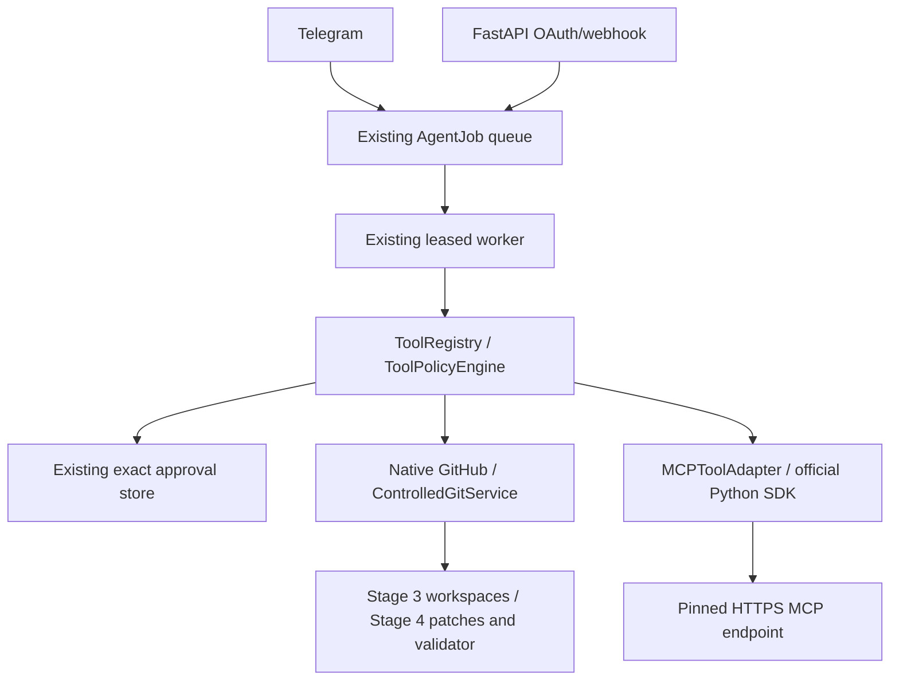

# Architecture

`app/main.py` owns FastAPI lifespan, dependency connections, Telegram startup/shutdown and authenticated webhook delivery. `api/health.py` contains liveness/readiness. Bot handlers are split into start/settings, providers, models, chat and fallback modules. Redis FSM state expires after 30 minutes; secret FSM fields are encrypted before entering Redis. Redis event isolation serializes each user's flows across replicas.

`services/` owns registration, audits, provider discovery, credential encryption, ownership, model tests and selection. `db/repositories/owned.py` checks ownership for every provider/model lookup, including indirect model-to-provider ownership. Telegram reads audit entries scoped to the current user. `db/models/` defines seven persistent tables. `alembic/versions/` contains an explicit initial migration; migrations run outside normal application startup.

`providers/base.py` defines the gateway interface. `registry.py` selects explicit types or detects exact known hostnames. Generic/OpenRouter/NVIDIA adapters use a common safety transport. aiohttp is used for provider transport because its explicit DNS resolver permits connection pinning; httpx is used for FastAPI test requests. Public DNS resolution, connection pinning, disabled redirects, deadlines and bounded response sizes are in `providers/http.py`. Discovery makes GET requests only; model tests/completions are POST requests on fixed paths. No external tool or shell execution is available.

PostgreSQL is the source of truth. Redis stores ephemeral FSM data, rate limits, operation locks, update deduplication and a future Redis Streams job foundation. `workers/base.py` defines a queue and handler contract; a worker runner, retries and a dead-letter queue belong to future stages. IDs only are allowed in job payloads.

Each Telegram operation gets an async database session. A new provider and its encrypted credentials are committed before testing; health/discovery updates are then committed separately. Provider row locks protect mutations until commit; active selection uses an atomic upsert. Provider failures become safe return values so health history is still persisted. Active selection is stored in `user_settings` as provider/model IDs. Removal/disable clears active settings; missing remote models become unavailable.

Polling uses one replica/one uvicorn process and serial update handling. Webhook mode supports multiple replicas through Redis FSM isolation and delivery deduplication. Delivery is at-least-once: a crash between a completion and the final Redis acknowledgement can repeat a request. Exactly-once paid execution is not promised. Long provider operations run inline in Stage 2; moving them to durable workers is recommended for high volume.

Future conversations/messages/projects/jobs/tool calls/approvals/MCP tables are intentionally deferred. Add them through new migrations and services, keeping the existing gateway and ownership boundary.

Translations live in `app/locales/ar.json` and `en.json`, with matching keys. Static UI strings use `tr()`. Provider/model IDs, capability identifiers and audit action identifiers remain technical values. Remote AI responses are displayed as plain text, split to Telegram limits.

## Stages 3/4

Storage → parsers/scanner → encrypted chunks/symbols/manifest → exact/optional semantic search → bounded ContextEngine. Project detail routes connect to the durable AgentJob queue. AgentWorker → Planner → ToolRegistry/Policy → owned workspace reads/patches or Approval pause → isolated validator → persisted verification. Redis separates worker/workspace/edit leases from Telegram FSM locks. New tables are defined in models/projects.py and models/agent.py; Alembic migrations apply them independently. See AGENT_RUNTIME.md for recovery and cancellation. No AI tool accesses GitHub or deploys Railway.

## Stages 5/6 boundaries

Native GitHub and official Python MCP adapters share the existing worker, ToolRegistry, ToolPolicyEngine and ApprovalService. Eight new integration tables plus AgentJob kind/encrypted payload fields preserve ownership and secret isolation. Git metadata lives beside the owned working tree in private metadata; MCP secrets live in encrypted SQL fields.

No additional language/runtime service was justified. Native GitHub is the sole repository-write authority; MCP cannot expose a parallel GitHub write path.
